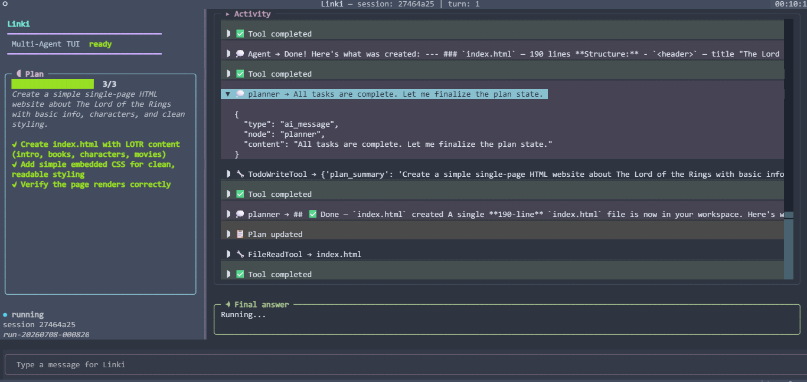

# Linki

**Linki** is a multi-agent coding assistant that runs entirely in your terminal. It takes a natural-language task, plans it, delegates the work to specialized sub-agents (research and implementation), executes file and shell operations inside a sandboxed workspace, and verifies the result — all while streaming a live plan and activity feed to a rich terminal UI.

It is built on [LangGraph](https://langchain-ai.github.io/langgraph/) for orchestration, [Textual](https://textual.textualize.io/) for the terminal interface, and any OpenAI-compatible chat model (OpenAI or DeepSeek) as the reasoning engine.



---

## Features

- **Multi-agent workflow** — an intent router first decides whether your input is a quick chat or a real task. Tasks go to a **planner/supervisor** that publishes a plan and delegates to two specialists:
  - **searchAgent** — web research via Tavily.
  - **codeAgent** — implementation using workspace-scoped file and shell tools.
- **Live, self-updating plan** — the plan is a dynamic checklist. Each item flips through `pending → in_progress → completed` (or `blocked`) the moment a sub-agent reports progress, with a `done/total` progress bar. Progress is streamed continuously, not just at the end of a step.
- **Verify-and-retry loop** — a **verifier** node checks the work against acceptance criteria and verification commands, and sends the task back to the planner (up to `--max-attempts`) until it passes.
- **Layered memory & context compression** — a context monitor tracks token usage and compresses history when it grows too large, so long-running tasks stay within budget.
- **Fresh workspace per run** — every start creates a new `run-<timestamp>` folder under a base directory (default `workspace/`), so checkpoints from one run never overwrite another.
- **Checkpoints & recovery** — each run snapshots the workspace (via a shadow Git repo) and writes a `RECOVERY.md`, so an interrupted run can be resumed with `--resume`.
- **Human-in-the-loop approvals** — risky shell commands pause for inline approval (configurable: `inline`, `auto`, or `deny`).
- **Multi-turn sessions** — conversation history is persisted per workspace and fed back as context on later turns.
- **Two front-ends** — a scrolling classic CLI and a two-column cockpit TUI (`--tui`).
- **Provider-flexible** — works with OpenAI or DeepSeek out of the box (any OpenAI-compatible endpoint).

---

## Installation

Requires **Python 3.10+**. [`uv`](https://docs.astral.sh/uv/) is recommended, but plain `pip` works too.

### With uv (recommended)

```bash
git clone <your-repo-url> linki
cd linki
uv sync
```

### With pip

```bash
git clone <your-repo-url> linki
cd linki
pip install -e .
```

### Configure API keys

Linki loads a `.env` file automatically (or reads your shell environment). Create a `.env` in the project root:

```dotenv
# OpenAI (default provider)
OPENAI_API_KEY=sk-...
OPENAI_MODEL=gpt-4o-mini          # optional, this is the default

# DeepSeek (optional alternative provider)
DEEPSEEK_API_KEY=...
DEEPSEEK_MODEL=deepseek-v4-flash  # optional, this is the default
DEEPSEEK_BASE_URL=https://api.deepseek.com

# Web research (optional; searchAgent needs this)
TAVILY_API_KEY=tvly-...
```

---

## Usage

### Launch the cockpit TUI

```bash
uv run linki --tui
```

You can also seed the first task and pick a provider:

```bash
uv run linki --tui "Create a single-page HTML site about The Lord of the Rings" --provider openai
```

Each start creates a fresh workspace, e.g. `workspace/run-20260708-000820/`, shown in the sidebar.

### One-shot CLI

```bash
uv run linki "Summarize the files in this workspace"
uv run linki "Create a Tetris game as a single HTML file" --provider deepseek --max-attempts 5
```

### Resume an interrupted run

```bash
uv run linki --resume workspace/run-20260708-000820
```

### Key options

| Option | Default | Description |
| --- | --- | --- |
| `task` (positional) | — | The natural-language task. Optional when `--resume` or `--tui` is used. |
| `--workspace`, `-w` | `workspace` | Base directory. A fresh `run-<timestamp>` folder is created inside it each start. |
| `--provider`, `-p` | `openai` | Reasoning provider: `openai` or `deepseek`. |
| `--model`, `-m` | provider default | Override the model name. |
| `--max-attempts` | `3` | Max planner ↔ verifier retry cycles. |
| `--approval-mode` | `inline` | Risky-command handling: `inline`, `auto`, or `deny`. |
| `--checkpoint-mode` | `light` | Checkpoint detail: `light`, `strict`, or `off`. |
| `--trace-mode` | `on` | Record a run trace: `on` or `off`. |
| `--resume` | — | Resume a specific `run-*` folder from its latest checkpoint. |
| `--tui` | off | Launch the Textual cockpit interface. |
| `--verbose` | off | Print raw events and checkpoint progress (CLI). |

> If you launch without `uv`, the console scripts `linki` / `Linki` are available after installation (`linki --tui`).

---

## How it works

```
                 ┌──────────────┐
   user input →  │ intent_router│──── chat ──→ chat_responder → answer
                 └──────┬───────┘
                        │ task
                        ▼
                 ┌──────────────┐     delegates    ┌────────────┐
                 │   planner /  │ ───────────────→ │ searchAgent│  (web research)
                 │  supervisor  │ ───────────────→ │  codeAgent │  (files + shell)
                 └──────┬───────┘                  └────────────┘
                        ▼
                 ┌──────────────┐   over budget   ┌────────────────────┐
                 │context_monitor│ ─────────────→ │ context_compressor │
                 └──────┬───────┘                  └────────────────────┘
                        ▼
                 ┌──────────────┐   fail (retry)
                 │   verifier   │ ───────────────→ back to planner
                 └──────┬───────┘
                        │ pass
                        ▼
                     final answer
```

The planner publishes the plan via a `TodoWriteTool`, and the codeAgent reports progress via a `TodoUpdateTool`. Both stream as events that the TUI applies to the checklist in real time.

---

## Project structure

```
linki/
├── docs/
│   └── linki-tui.png            # cockpit TUI screenshot
├── pyproject.toml               # package metadata, deps, console scripts
└── src/Linki/
    ├── __main__.py              # python -m Linki entry point
    ├── cli/
    │   ├── app.py               # Typer CLI: options, event rendering
    │   └── tui/
    │       ├── app.py           # Textual cockpit UI (sidebar plan + activity)
    │       ├── approval.py      # inline approval modal / gate
    │       └── logo.py          # startup logo + animation
    ├── core/
    │   ├── agent.py             # event streaming, session orchestration
    │   ├── session.py           # multi-turn sessions + run-folder creation
    │   ├── checkpoint.py        # Git-snapshot checkpoints + recovery
    │   ├── trace.py             # run trace recorder
    │   ├── state.py             # RuntimeState
    │   ├── approval.py          # approval request/decision types
    │   └── paths.py             # workspace-restricted path resolution
    ├── graph/
    │   ├── workflow.py          # LangGraph graphs (entry + main workflow)
    │   ├── nodes.py             # intent router, planner, verifier, context nodes
    │   ├── state.py             # LinkiGraphState / TodoItem schemas
    │   └── memory.py            # layered memory + compression events
    ├── agents/
    │   ├── code_agent.py        # implementation ReAct loop
    │   └── search_agent.py      # research ReAct loop
    ├── tools/
    │   ├── registry.py          # tool assembly
    │   ├── file_tools.py        # read / write / edit (workspace-scoped)
    │   ├── bash_tool.py         # sandboxed shell with risk gating
    │   ├── grep_tool.py         # workspace search
    │   └── web_search_tool.py   # Tavily web search
    ├── prompts/                 # system prompts per stage
    └── providers/
        └── openai_provider.py   # OpenAI / DeepSeek model factory
```

---

## Development

```bash
uv sync            # install project + dev deps (pytest is the configured runner)
uv run python -m Linki --help
```

---

## License

See the repository for license details.
